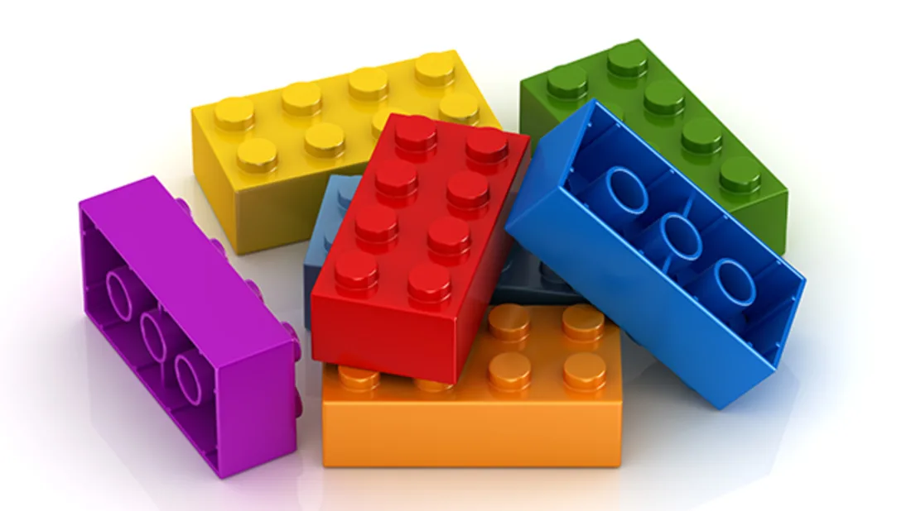

# Componentes



> Componentes React são como funções JavaScript. Eles aceitam entradas como propriedades (chamadas “props”) e retornam novos elementos React (JSX).

Os componentes permitem que a UI seja dividida em partes independentes e reutilizáveis, ou seja, trata cada parte da aplicação como um bloco isolado, livre de outras dependências externas.

## Componentes de Função e Classe

A maneira mais simples de definir um componente é escrever uma função JavaScript:

```jsx
function Welcome(props) {
  return <h1>Olá, {props.name}</h1>;
};
```

Este mesmo exemplo pode ser escrito em forma de Classe ES6:

```jsx
class Wellcome extends React.Component {
  render() {
    return <h1>Olá, {this.props.name}</h1>;
  }
}
```

Para o React, estes dois componentes são equivalentes.

Antes da versão 16.8 do react utillizava-se _classes_ para componentes que precisavem guardar seu estado (stateful) e _funções_ para componente que não utiliza estado (stateless)

A partir da versão 16.8, com a vinda dos _Hooks_, esta separação não é mais necessária, ou seja, conseguimos criar componentes statful e stataless tanto com _classe_ quanto com _funções_.
Hoje em dia, a recomendação é que se utilize Function Components ao invés de Class Components.

## Renderizando um Componente

O exemplo assim pode ser renderizado da seguinte maneira:

```jsx
function Welcome(props) {
  return <h1>Olá, {props.name}!</h1>;
}

const element = <Welcome name="Carla" />;
ReactDOM.render(element, document.getElementById('root'));
```

**Saída:** Olá, Carla!

> **Atenção**
> _Sempre inicie os nomes dos componentes com letra maiúscula._
>
> No React, componente que começam com letra minúscula são tags do DOM.
> O ```<div />``` representa a tag **div** do HTML, porém o ```<Welcome />```representa o componente **Welcome** que acabamos de criar.

## Passando informações para um componente

A maneira de passar informações para um componente é através de suas propriedades (props).

> **Props são somente leitura**
>
> Um componente nunca deve modificar seus próprios props

## Compondo Componentes

A composição é a base da reutilização de componentes de UI. O React permite compor facilmente os componentes React existentes, juntamente com elementos HTML nativos, para desenvolver componentes mais complexos.

```jsx
const Welcome = (props) => <h1>Olá, {props.name}</h1>;

function App() {
  return (
    <div>
      <Welcome name="Carla" />
      <Welcome name="Julia" />
      <Welcome name="Amanda" />
    </div>
  );
}

ReactDOM.render(<App />, document.getElementById('root'));
```

## Extraindo Componentes

Uma boa prática que devemos adotar no React é a de construir componentes pequenos.
Para exemplificar vamos pegar o componente ```Comment```, abaixo, que descreve um comentário em uma rede social.

Ele tem como entrada (props):

* author (objeto)
* text (string)
* date (data)

```jsx
function Comment(props) {
  return (
    <div className="Comment">
      <div className="UserInfo">
        
        <div className="UserInfo-name">
          {props.author.name}
        </div>
      </div>
      <div className="Comment-text">
        {props.text}
      </div>
      <div className="Comment-date">
        {formatDate(props.date)}
      </div>
    </div>
  );
}
```

Podemos ver que este é um componente complicado de alterar, por conta de todo o aninhamento. Também é difícil reutilizar suas partes individuais.

1. Extraindo o Avatar

```jsx
function Avatar(props) {
  return (
    
  )
}

function Comment(props) {
  return (
    <div className="Comment">
      <div className="UserInfo">
        <Avatar user={props.author} />
        <div className="UserInfo-name">
          {props.author.name}
        </div>
      </div>
      <div className="Comment-text">
        {props.text}
      </div>
      <div className="Comment-date">
        {formatDate(props.date)}
      </div>
    </div>
  );
}

```

2. Vamos extrair o UserInfo

```jsx
function Avatar(props) {
  return (
    
  )
}

function UserInfo(props) {
  return (
    <div className="UserInfo">
      <Avatar user={props.user} />
      <div className="UserInfo-name">
        {props.user.name}
      </div>
    </div>
  )
}

function Comment(props) {
  return (
    <div className="Comment">
      <UserInfo user={props.author}>
      <div className="Comment-text">
        {props.text}
      </div>
      <div className="Comment-date">
        {formatDate(props.date)}
      </div>
    </div>
  );
}

```

Com isso o componente fica com uma leitura mais simples, reutilizavel e com uma melhor manutenabilidade.
