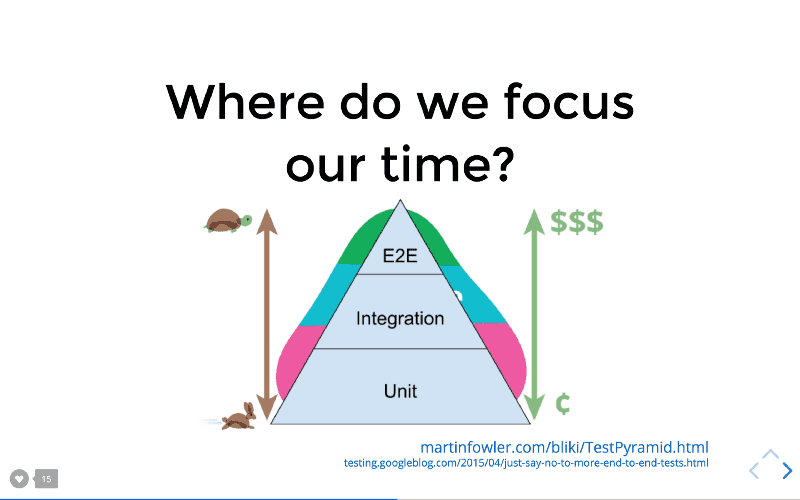
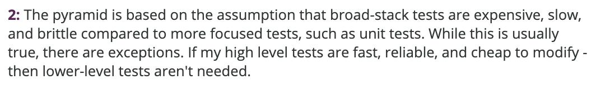

# Testes unitários

**DISCLAIMER:**

Vamos assumir que a linguagem de programação é **JavaScript**.

O Framework de teste padrão será o **Jest** e todos os exemplos serão baseados nele, mas vamos falar sobre outros frameworks de teste conhecidos para o JavaScript.

O _mindset_ utilizado será para aplicações **Frontend**.

## O que é um teste unitário ou de unidade?

Por teste unitário ou teste de unidade é entendido que testamos a menor parte **testável** de um software, o que podemos assumir como uma função ou método de uma classe.

Por exemplo, dado a função:

```js
function sum(value1, value2) {
  return value1 + value2;
}
```

Um teste simples para essa função seria:

```js
expect(sum(1, 2)).to.equal(3);
```

O exemplo acima é um clássico que você vai poder encontrar por toda internet. Mas para que serve teste unitário? Que dor que o teste resolve? O que devemos testar? Como testar?

## Função dos testes unitários

Os testes unitários nos dão uma vantagem muito maior do que deixar os pequenos pedaços testados e ver o coverage subindo, eles nos dão **confiança**. Confiança que nossa aplicação vai funcionar quando seus usuários a utilizarem.

Outra vantagem dos testes unitários é quando precisamos refatorar.

Já pensou se precisar refatorar a função **sum** para que, internamente, ela fique mais explicita?

```js
function sum(value1, value2) {
  const result = value1 + value2;

  return result;
}
```

Ou se a gente mudasse de _named function_ para _arrow function_?

```js
const sum = (x, y) => x + y;
```

Refatoramos os **detalhes da implementação** de nossa função, mesmo assim o teste continuaria passando.

Este é o poder dos testes: Nos dar confiança tanto para mudanças tanto para garantir o funcionamento do código em produção.

## Frameworks de teste

Existem vários framworks de teste para JavaScript, como Cypress, Jasmine, Mocha e Jest.

Quando usamos o Create React App para criar nossa aplicação React, o Jest faz parte do pacote que é instalado pelo CRA.

Jest foi criado pelo Facebook, é um framework que não precisa de muita configuração, uma vez que ele já vem com suporte a mock e sua biblioteca de assersões. Fora isso, é bem documentado e considerado como uma rápido e performático.

Jasmine e Mocha foram (e são) frameworks de teste muito famosos até 2016 segundo o site [State of JS 2020 survey](https://2020.stateofjs.com/en-US/technologies/testing/), porém perderam espaço para o Jest pela facilidade de instalação e configuração.

Já o Cypress é um framwork voltado mais para testes de ponta a ponta, os famosos E2E (end to end) e muito utilizado para validação da UI e fluxos completos. Também é possível realizar testes de integração e até unitários.

## Bibliotecas de teste

Dentre as várias bibliotecas de teste, vamos destacar as duas mais utilizadas hoje no Frontend, principalmente com React: **Enzyme e React Testing Library**.

Tanto Enzyme quanto RTL são "utilitários" que usamos junto ao nosso framework de teste, deixando mais fácil criar testes para nossos componentes construidos com o React. Geralmente essas bibliotecas adicionam formas de manipular e/ou simular eventos como clique e algumas formas de realizar a assersão dos nossos testes.

Nosso foco aqui será com a biblioteca React Testing Library. Não entraremos nos detalhes de configuração inicial de cada biblioteca.

### Enzyme

Criada pela equipe da AirBnB que já construiu vários outros componentes para React e também uma Style Guide muito famosa utilizada por muitos Devs quando falamos de desenvolvimento JavaScript / TypeScript.

[Na documentação oficial do Enzyme](https://enzymejs.github.io/enzyme/), diz que o Enzyme é um utilitário de testes para o React que torna fácil testar a saída de nossos componentes.

A API do Enzyme é jQuery-like, ou seja, imita a API do jQuery para localizar elementos, disparar eventos com métodos como `find()` e ainda pondendo buscar elementos por `id`, `name` e `className`, por exemplo.

No Enzyme possuímos basicamente três métodos para renderizar um componente para o teste:

- **mount()**

  Renderiza toda a arvore DOM com todos os childrens e dá a possibilidade de usar toda API do Enzyme simulando cliques, acessando elementos que foram renderizados na DOM e muito mais.

- **shallow()**

  Renderiza somente o componente sem seus filhos e só torna possível simular cliques e outros eventos apenas para o componente renderizado em questão, uma vez que os componentes filhos não são renderizados.

  Atualmente a API de Hooks do React [não funciona muito bem com shallow rendering](https://enzymejs.github.io/enzyme/#react-hooks-support).

- **render()**

  Retorna uma string com o código gerado em HTML.

Abaixo, alguns exemplos de testes utilizando Enzyme:

```js
import MyComponent from "./MyComponent";
import Foo from "./Foo";
import { expect } from "chai";
import { shallow } from "enzyme";
import { mount } from "enzyme";

// Shallow
it("renders three <Foo /> components", () => {
  const wrapper = shallow(<MyComponent />);
  expect(wrapper.find(Foo)).to.have.lengthOf(3);
});

// Mount
it("allows us to set props", () => {
  const wrapper = mount(<Foo bar="baz" />);
  expect(wrapper.props().bar).to.equal("baz");
  wrapper.setProps({ bar: "foo" });
  expect(wrapper.props().bar).to.equal("foo");
});

// Render
it("renders three `.foo-bar`s", () => {
  const wrapper = render(<Foo />);
  expect(wrapper.find(".foo-bar")).to.have.lengthOf(3);
});
```

### React Testing Library

> The more your tests resemble the way your software is used, the more confidence they can give you. [Kent C. Dodds](https://kentcdodds.com/)

> Quanto mais seus testes se assemelham à forma como o software é usado, mais confiança eles podem lhe dar. [Google Translate](https://translate.google.com/?sl=en&tl=pt&text=The%20more%20your%20tests%20resemble%20the%20way%20your%20software%20is%20used%2C%20the%20more%20confidence%20they%20can%20give%20you.&op=translate)

Essa biblioteca para o React faz parte de um conjunto de bibliotecas chamado **[Testing Library](https://testing-library.com/)** que é um utilitário para testes que encoraja boas práticas de teste. Além de React, você pode encontrar para uma série de outras bibliotecas e frameworks como Angular, Vue e Cypress.
React Testing Library foi escrita por **[Kent C Dodds](https://kentcdodds.com/)** que tem apresentado uma outra forma de pensar em testes, principalmente para o Frontend.

A principal ideia dessa biblioteca é que não devemos nos atentar aos detalhes de implementação durante o teste e simplesmente devemos simular o comportamento do usuário exatamente com o que será visto em tela.

Kent escreveu um belo artigo sobre o motivo que **[detalhes de implementação nos testes são uma receita para o desastre](https://kentcdodds.com/blog/testing-implementation-details)**.

### Como a biblioteca RTL funciona?

O _mindset_ dessa biblioteca é de criar testes que se assemelham com o comportament do usuário da apliação.

O que deve acontecer quando o usuário clicar no botão? O que ele vai ver? Quais elementos estão presentes na tela?

Quando executamos o teste com essa biblioteca o componente sempre será montado com todos os seus filhos e irá se comportar exatamente como se estivesse sendo executado no browser.

E este é o motivo de não precisarmos preocupar com os detalhes de implementação durante o teste. Mesmo que, internamente o componente seja alterado, o teste continuará passando.

Um uso muito importante dessa biblioteca é de trabalharmos com TDD, onde podemos escrever os testes com os resultados esperados e depois ir construindo o componente ir vendo os testes passarem, uma vez que não precisamos nos preocupar com os detalhes da implementação da funcionalidade e isso é muito lindo.

A RTL também sugere fortemente que devemos sempre pensar em acessibilidade e a biblioteca nos fornece uma API para buscar elementos inclusive pela _[Role](https://developer.mozilla.org/en-US/docs/Web/Accessibility/ARIA/Roles)_. Existe na documentação da Testing Library [uma sessão dedicada](https://testing-library.com/docs/queries/about#priority) para explicar os métodos disponíveis pela ordem de prioridade para acessar algum componente ou fazer alguma asserção.

## Além dos testes unitários

Segundo a documentação oficial da biblioteca, podemos escrever além dos testes unitários, testes de integração e até mesmo testes de ponta a ponta, os famosos E2E.

Podemos integrar também a bibliteca de asserção com o Cypress e usar os mesmos métodos que utilizamos nos testes unitários com os testes E2E e usando o mesmo mindset de sempre testar o que o usuário está vendo, ou o que realmente ele vai fazer e ver.



Essa é a famosa pirâmide de testes adaptada por Kent C. Dodds, evidenciando que, testes unitários são mais baratos e rápidos, então deveríamos gastar mais tempo nos testes unitários, certo?

Segundo Dodds, faltou dizer nessa pirâmide que, quanto mais subimos, aumentamos o coeficiente de confiança para cada forma de teste

Martin Fowler, termina o assunto sobre a pirâmide de testes afirmando o seguinte:


Agora, segundo Kent, nossas ferramentas de teste são incriveis e essa afirmação de Fowler está "menos verdadeira" e então ele mudou o conceito de pirâmide e criou o Troféu dos testes: ([Confira neste Tweet de Kent](https://twitter.com/kentcdodds/status/1141365123296051201?ref_src=twsrc%5Etfw%7Ctwcamp%5Etweetembed%7Ctwterm%5E1141365123296051201%7Ctwgr%5E%7Ctwcon%5Es1_&ref_url=https%3A%2F%2Fkentcdodds.com%2Fblog%2Fwrite-tests))


De baixo para cima temos:

- **Testes estáticos (Static):**

  Utilizamos com ferramentas como ESLint ou com TypeScript que consegue pegar erros de Typos e regras bem mais rápido do que num Code Review. A analize é realizda enquanto estamos digitando o código.

- **Testes unitários (Unit):**

  Verifica se, individualmente e isoladas, as partes funcionam como esperado.

- **Testes de integração (Integration):**

  Verifica se as partes funcionam em harmonia quando estão juntas.

- **Testes de ponta a ponta (End to End):**

  Se comporta como um usuário usando a aplicação para verificar se tudo está funcionando corretamente. Tambem chamado as vezes de Teste funcional (Functional testing) ou e2e.

Segundo o Troféu dos testes, devemos ter mais testes de integração do que unitários e isso se dá muitas vezes porque não temos como ou não vale a pena testar de forma isolada um componente de UI, como um botão ou um input estilizado, por exemplo.

Pense: Não importa quantas propriedades o componente de botão ou input recebem. É bom, se for possível, testá-los isoladamente, mas testar integrados com uma página onde os botões e o input realmente serão utilizados vai nos dar muito mais confiança nos testes e quem sabe até nem precisaríamos nos preocupar com os testes unitários para esses componentes, hein?

Talvez poderíamos passar mais tempo escrevendo testes de integração e criando menos mocks porque hoje eles seriam uma balança perfeita entre confiança e velocidade/custo de desenvolvimento.

## Finalizando

O assunto sobre testes é de fato cheio de polêmicas.

A linha que divide o que é cada tipo de teste, saber o que testar, quando testar e qual ferramenta usar é muito tênue e tudo isso gera muita dúvida e muita discussão.

O fato é que os testes devem nos dar **confiança** para fazermos as alterações que precisarmos em nossa aplicação e garantindo que a aplicação continuará funcionando em produção.

Não há dúvidas que essa é a essência do teste de software.
