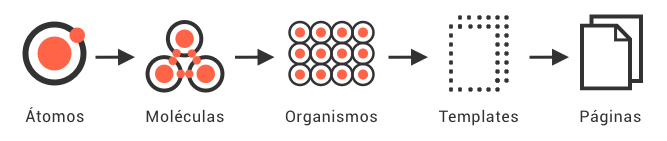

# Atomic Design
O Atomic Design é uma metodologia para criar design systems desenvolvida pelo [Brad Frost](https://bradfrost.com), é uma analogia científica que nos ajuda a pensar as interfaces de uma maneira mais completa.

## Motivação
A motivação surgiu analisando algumas características do projeto em conjunto com as definições da equipe de UX.

Projetos grandes que requerem manutenção ao longo do tempo, exigem que nossas interfaces tenham uma alta capacidade de replicação e expansão de forma simples e sem perder a essência da experiência atual.

É neste ponto que entra o Atomic Web Design, onde começamos a entender nossas interfaces como quebra-cabeças, facilitando nosso trabalho para estruturar nossos componentes e construir a interface do sistema modular.

## Benefícios

* Consistência e coesão.
* Fluxo de trabalho para a equipe - economizando tempo e dinheiro.
* Fluxo de trabalho mais colaborativo entre todas as área envolvidas no projeto.
* Vocabulário compartilhado entre todos em uma empresa, incluindo fornecedores terceiros.
* Documentação que ajuda as partes interessadas: colegas e terceiros a aprenderem sobre a biblioteca e repositório.
* Facilita modificação, ampliação e melhoria.

## Estrutura

### Átomos

Os Átomos são os blocos básicos da interface. Os átomos são nossas tags HTML, como um `<label>` de formulário, um `<input>` ou um `<button>`.
São basicamente os componentes mais simples e reutilizáveis da aplicação.

Os átomos também podem incluir elementos mais abstratos, como paletas de cores e fontes.

Cada átomo de interface possui suas próprias propriedades exclusivas, como as dimensões de uma imagem ou o tamanho da fonte principal de um cabeçalho. Essas propriedades influenciam como cada átomo deve ser aplicado na interface.

### Moléculas

Moleculas são basicamente agrupamentos de um ou mais átomos que funcionam juntos como uma unidade. Por exemplo um campo de busca que combina as molécuas de `<label>`, `<input>` e `<button>`.  

### Organismos

Organismos são componentes de interface relativamente complexos compostos por grupos de moléculas e/ou átomos e/ou outros organismos. Esses organismos formam seções distintas de uma interface, como `header`, `footer` ou um `sidebar`, por exemplo.

### Template

